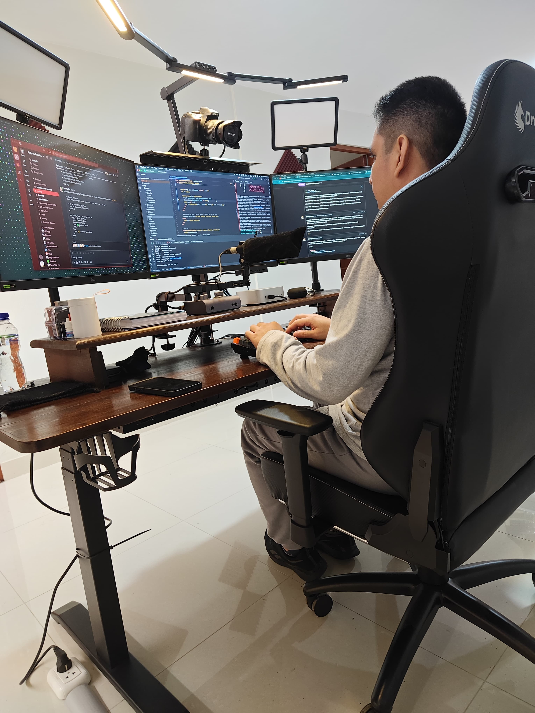

<h1 align="center">Hello  I'm Renzo Díaz</h1>

  
  

<table>
<tr>
<td width="65%" valign="top">

### About Me

I'm a **Full Stack Developer** with **9+ years** building web apps that scale and delight. I work across the stack, from Ruby on Rails APIs to React and Vue.js front-ends, and I'm **remote-ready**.

- 🔭 Currently building products in **fintech** and **healthcare**
- 🌱 Always learning, recently deepening **Hotwire** and **Kamal** deployments
- 💬 Ask me about **Rails**, **React**, **Vue**, or scaling web apps
- 📫 Reach me at **im.renzodiaz@gmail.com**
- 🌐 Portfolio → **[renzodiaz.dev](https://renzodiaz.dev)**

</td>
<td width="35%" valign="top" align="center">

👨🏻‍💻 The code lab — where code becomes product

</td>
</tr>
</table>

---

### Tech Stack

**Languages & Frameworks**

  

**Databases, Infra & Tooling**

  

**Rails Ecosystem & Scalability**

  
  
  
  
  
  
  
  
  
  
  
  
  
  
  

---

### Connect with me

  
  
  

---